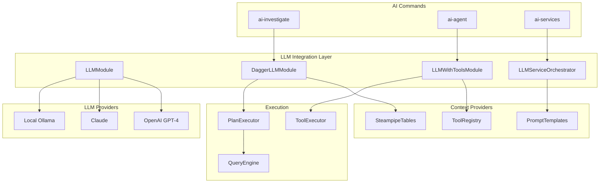
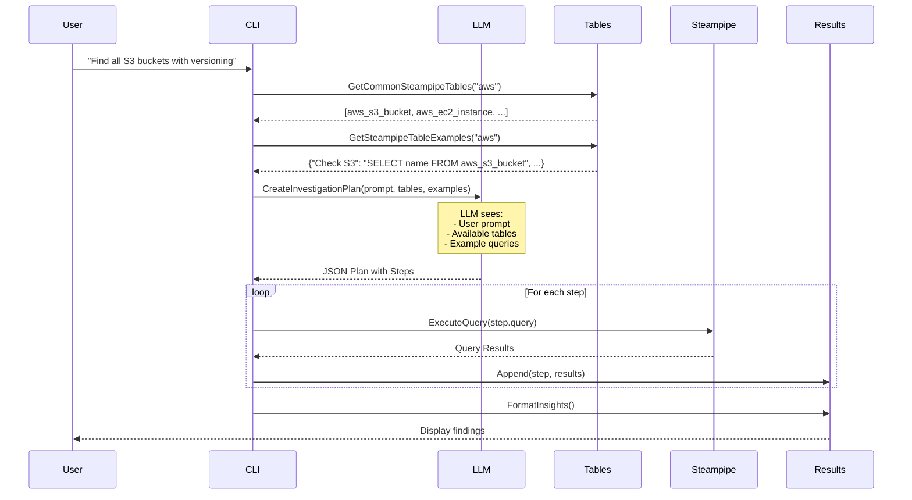
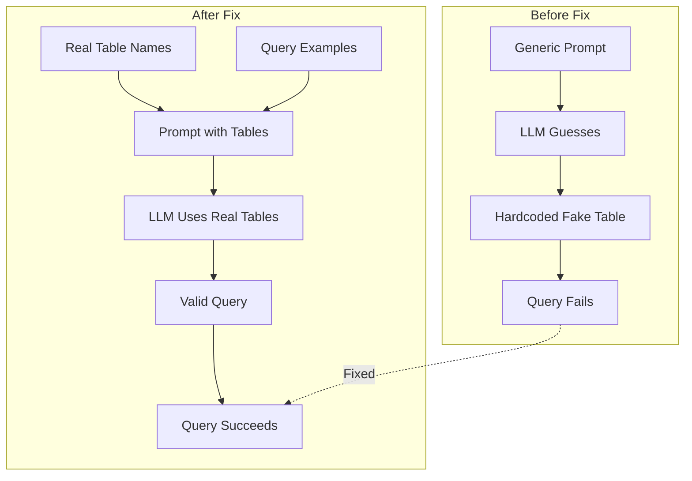
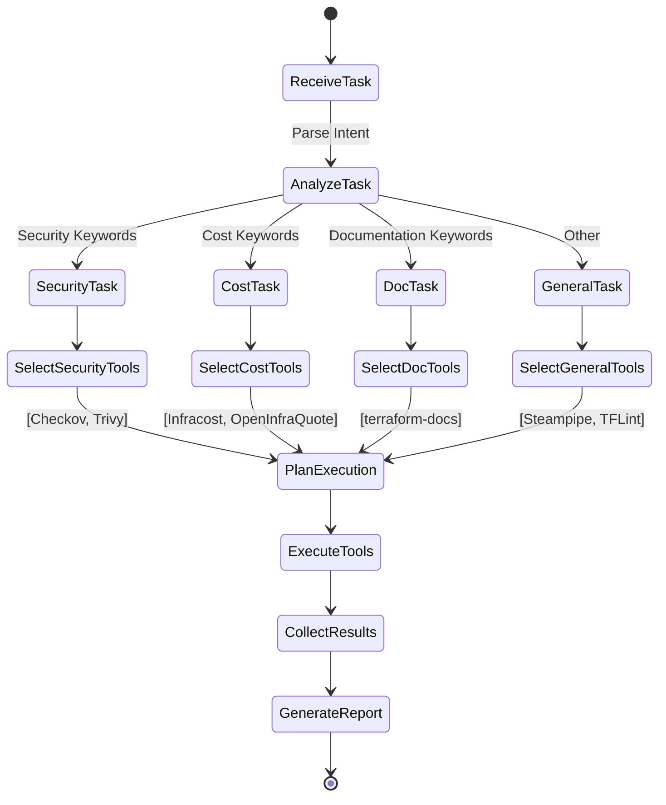
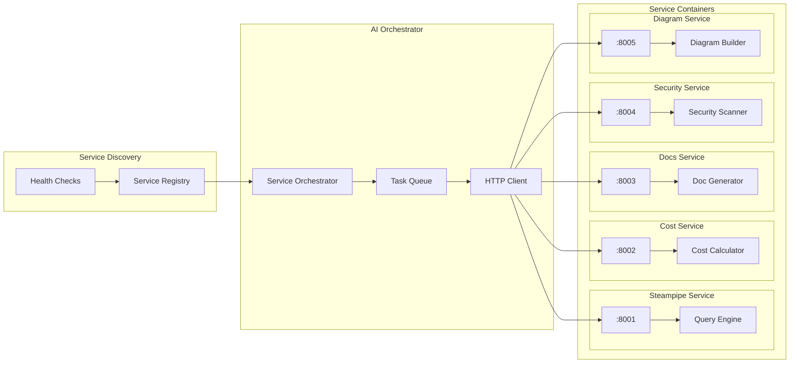
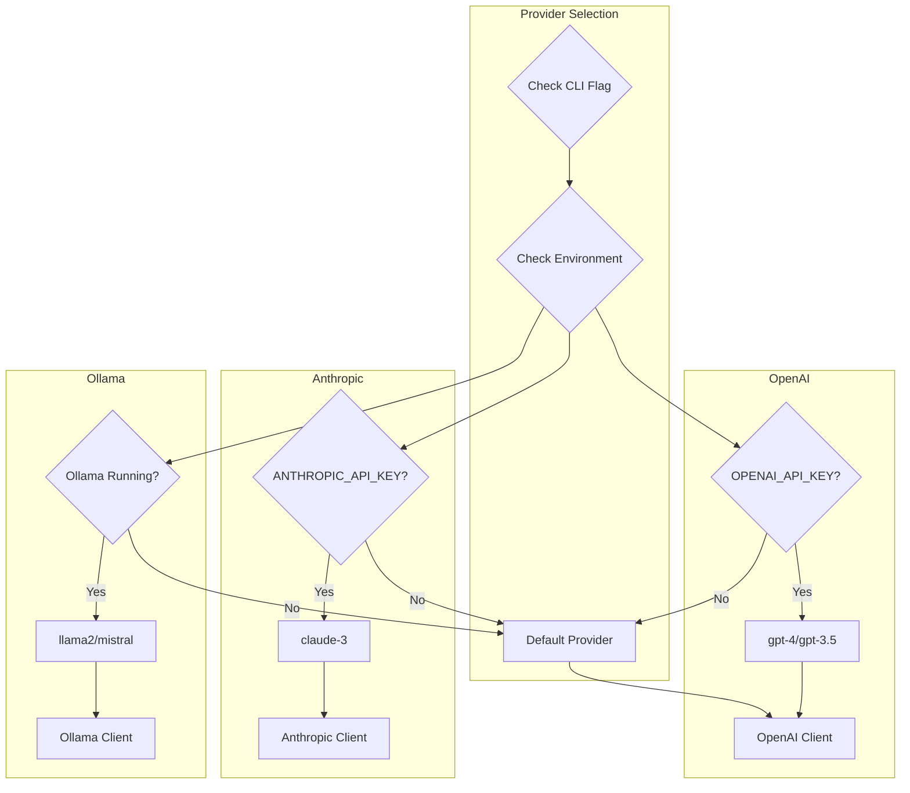
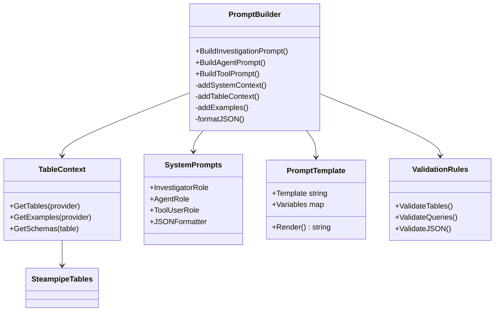
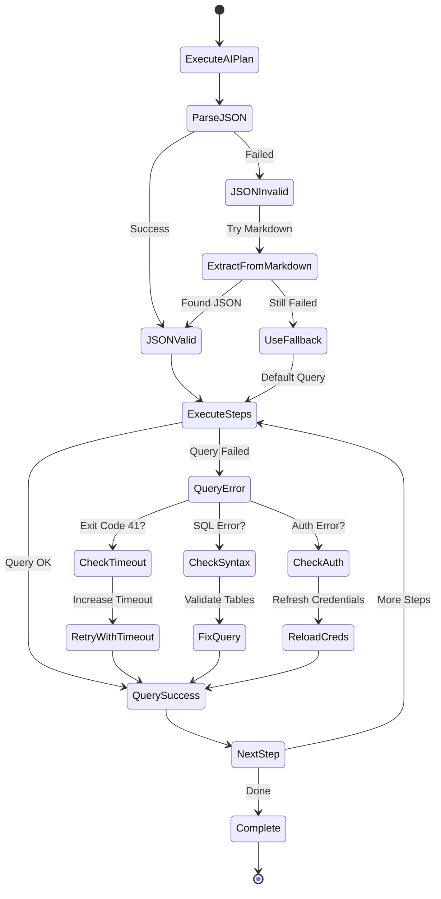
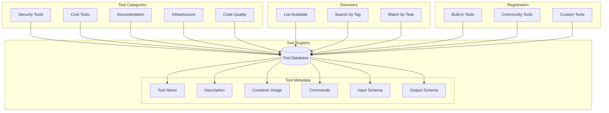
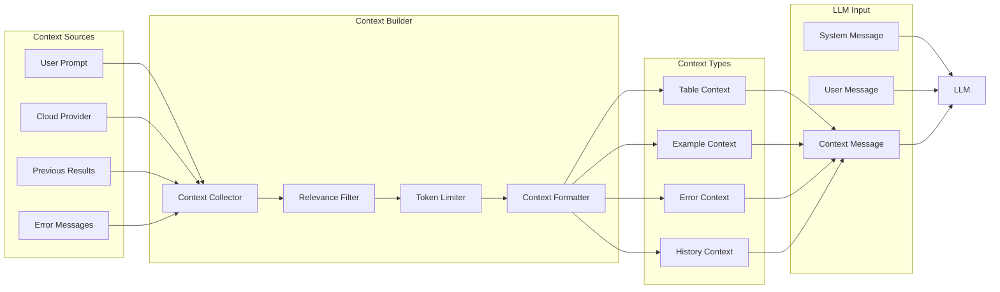

# AI System Architecture - Ship CLI

This document provides detailed diagrams of the AI components and their interactions within Ship CLI.

## AI Components Overview

## AI Investigation Detailed Flow

## AI Hallucination Prevention

## AI Agent Tool Selection

## AI Services Microservices Architecture

## LLM Provider Selection

## Prompt Engineering Architecture

## AI Error Recovery

## Tool Registry and Discovery

## AI Context Management

---

These diagrams provide detailed insights into:
- How the AI components are structured
- The flow of AI-powered investigations
- How hallucination prevention works
- Tool selection logic for AI agents
- Microservices architecture for AI services
- LLM provider selection and fallbacks
- Prompt engineering architecture
- Error recovery mechanisms
- Tool registry and discovery
- Context management for AI interactions

Together with the main architecture diagrams, this provides a comprehensive visual guide to understanding and extending Ship CLI's AI capabilities.