# Ship CLI Architecture Diagrams

This document provides visual representations of the Ship CLI architecture, workflows, and module system using Mermaid diagrams.

## Table of Contents
1. [High-Level Architecture](#high-level-architecture)
2. [Core Components](#core-components)
3. [User Workflows](#user-workflows)
4. [Module System](#module-system)
5. [AI Investigation Flow](#ai-investigation-flow)
6. [CloudShip Integration](#cloudship-integration)
7. [Dagger Container Orchestration](#dagger-container-orchestration)
8. [Adding New Modules](#adding-new-modules)

## High-Level Architecture

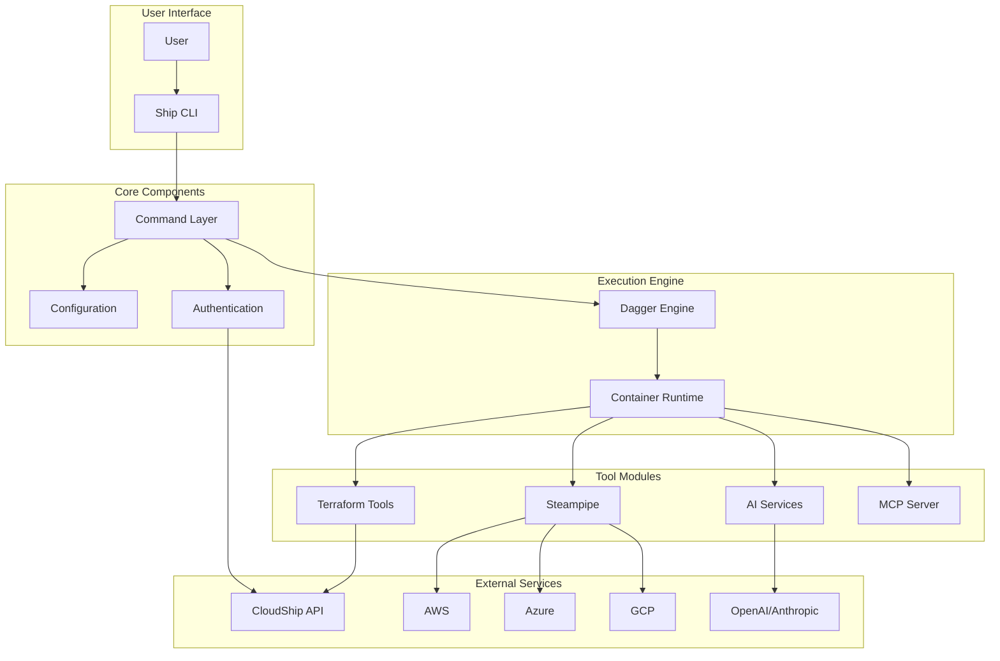

## Core Components

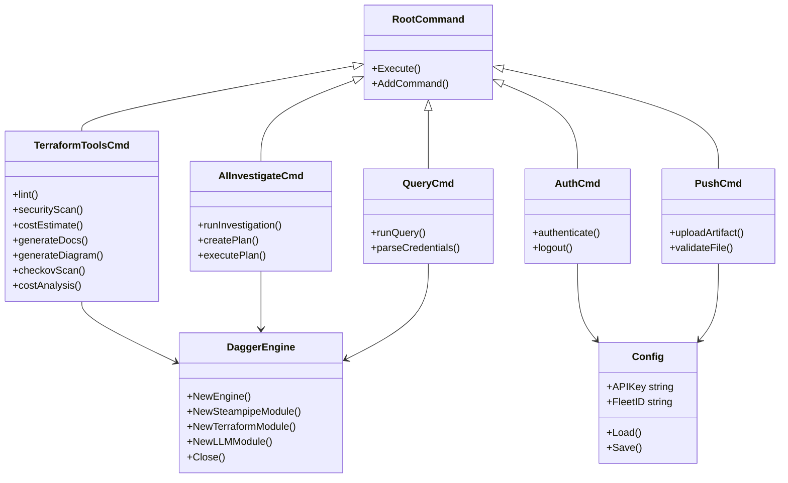

## User Workflows

### Terraform Analysis Workflow

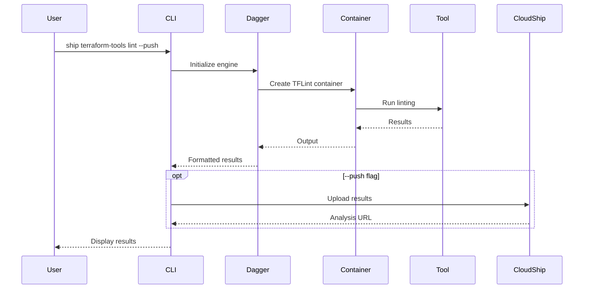

### AI Investigation Workflow

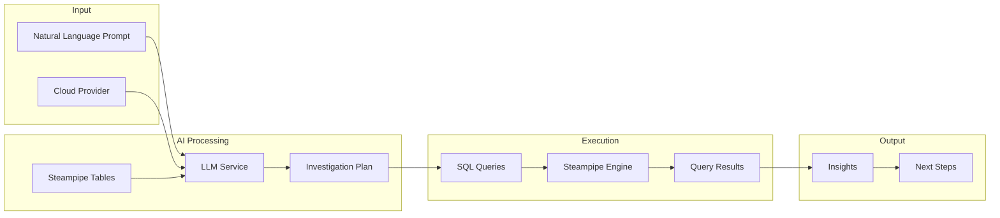

## Module System

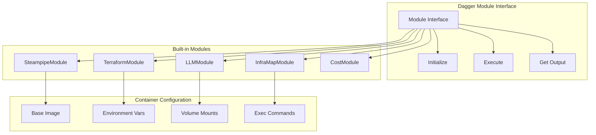

## AI Investigation Flow

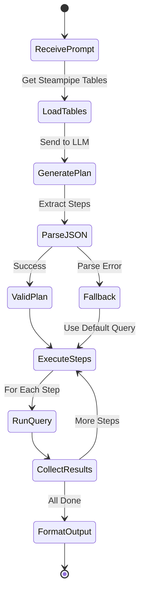

## CloudShip Integration

```mermaid
flowchart TD
    subgraph "Ship CLI"
        TOOL[Tool Execution]
        RESULT[Tool Results]
        PUSH[Push Handler]
    end
    
    subgraph "Preparation"
        B64[Base64 Encode]
        META[Add Metadata]
        TAGS[Add Tags]
    end
    
    subgraph "CloudShip API"
        AUTH_CHECK{Authenticated?}
        API[/v1/artifacts]
        RESPONSE[Analysis URL]
    end
    
    TOOL --> RESULT
    RESULT --> PUSH
    PUSH --> B64
    B64 --> META
    META --> TAGS
    TAGS --> AUTH_CHECK
    
    AUTH_CHECK -->|Yes| API
    AUTH_CHECK -->|No| ERROR[Auth Error]
    
    API --> RESPONSE
    RESPONSE --> USER[Display to User]
```

## Dagger Container Orchestration

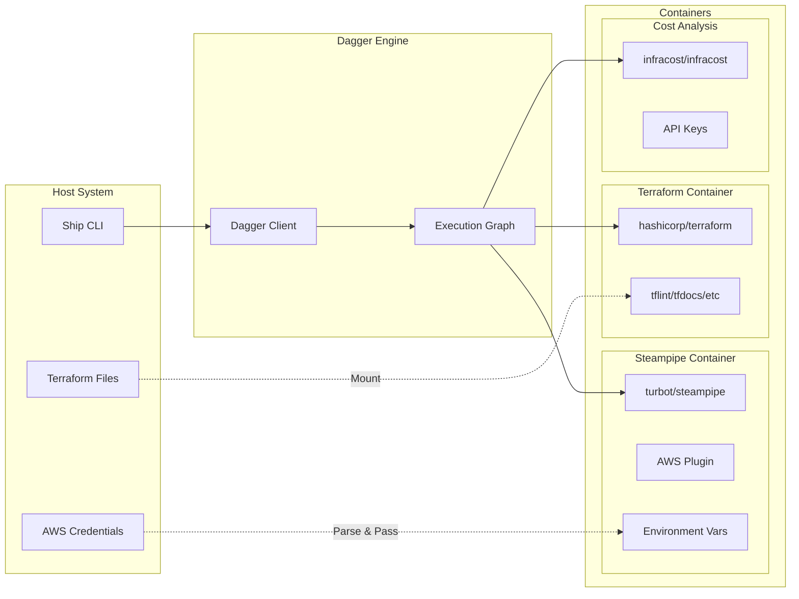

## Adding New Modules

### Module Creation Workflow

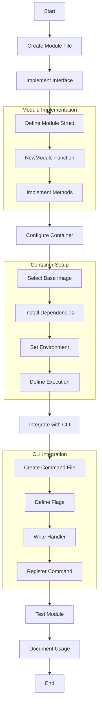

### Module Interface

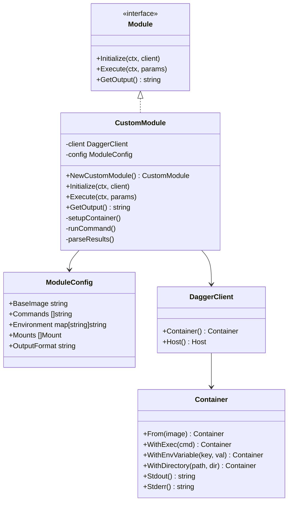

## Credential Flow

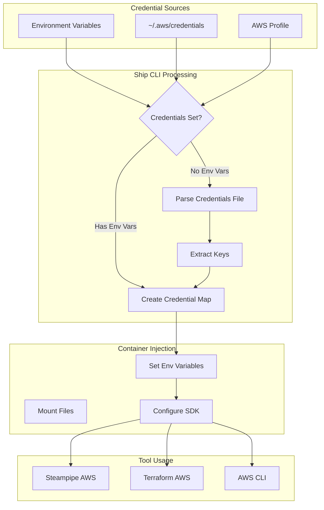

## Error Handling Flow

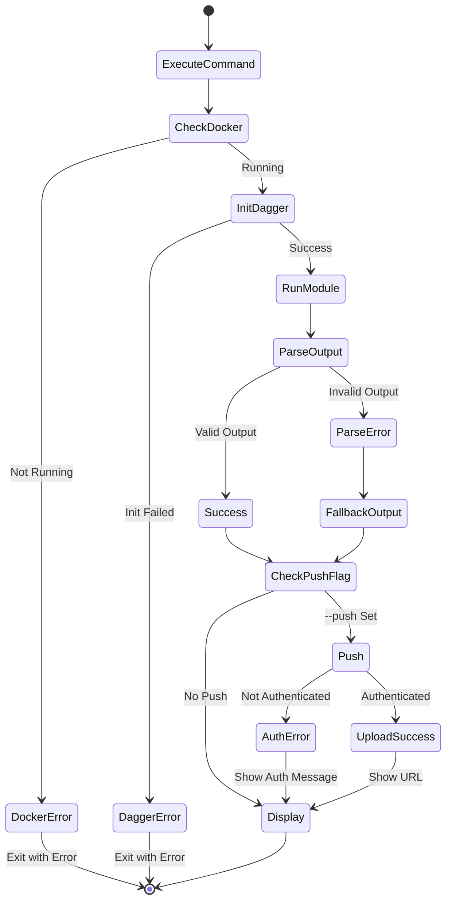

## MCP Server Architecture

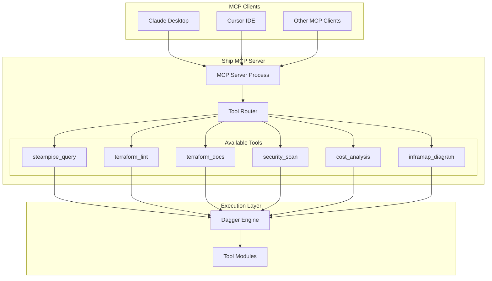

## Community Module Integration

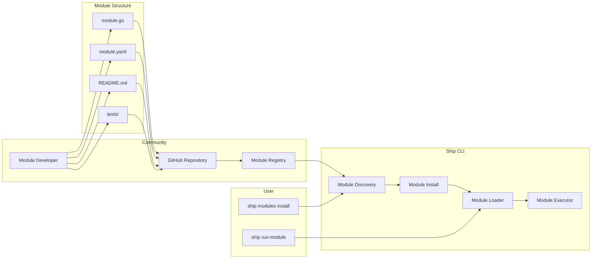

---

This comprehensive set of diagrams covers:
- Overall architecture and component relationships
- User workflows for different features
- Module system and extensibility
- AI investigation process
- CloudShip integration details
- Container orchestration with Dagger
- How to add new modules
- Credential management flow
- Error handling patterns
- MCP server architecture
- Community module integration

Each diagram provides a different perspective on how Ship CLI works, making it easier for developers to understand and extend the system.