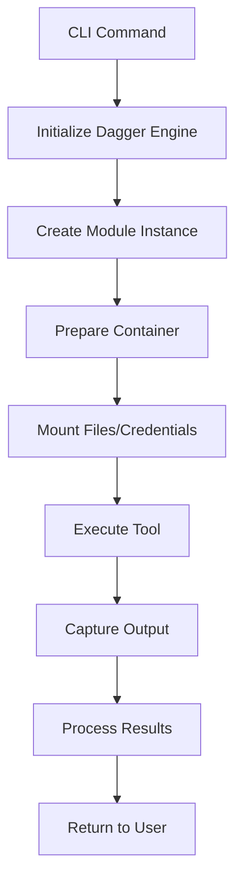

# Dagger Modules in Ship CLI

## Overview

Ship CLI uses Dagger to run containerized tools without requiring local installations. This document explains how to add new Dagger modules and integrate them into the Ship CLI.

## Architecture

```
ship/
├── internal/
│   ├── dagger/
│   │   ├── engine.go          # Core Dagger engine wrapper
│   │   ├── pipeline.go        # Steampipe pipelines
│   │   └── modules/           # Individual tool modules
│   │       ├── openinfraquote.go
│   │       ├── infrascan.go
│   │       └── terraform_docs.go
```

## How Dagger Modules Work

Each Dagger module in Ship CLI:
1. Defines a container with the necessary tools
2. Mounts required files/credentials from the host
3. Executes commands inside the container
4. Returns results to the caller

## Creating a New Dagger Module

### Step 1: Create the Module File

Create a new file in `internal/dagger/modules/` following this template:

```go
package modules

import (
    "context"
    "fmt"
    
    "dagger.io/dagger"
)

type YourToolModule struct {
    client *dagger.Client
    name   string
}

func NewYourToolModule(client *dagger.Client) *YourToolModule {
    return &YourToolModule{
        client: client,
        name:   "your-tool",
    }
}

func (m *YourToolModule) Run(ctx context.Context, workDir string, args []string) (string, error) {
    // Create container from base image
    container := m.client.Container().
        From("your-tool:latest")
    
    // Mount working directory if needed
    if workDir != "" {
        src := m.client.Host().Directory(workDir)
        container = container.WithDirectory("/workspace", src).
            WithWorkdir("/workspace")
    }
    
    // Execute command
    container = container.WithExec(args)
    
    // Get output
    return container.Stdout(ctx)
}
```

### Step 2: Add Module to Engine

Update `internal/dagger/engine.go` to include a factory method:

```go
func (e *Engine) NewYourToolModule() *modules.YourToolModule {
    return modules.NewYourToolModule(e.client)
}
```

### Step 3: Create CLI Command

Add a command in `internal/cli/` to expose the module:

```go
var yourToolCmd = &cobra.Command{
    Use:   "your-tool",
    Short: "Run YourTool analysis",
    RunE:  runYourTool,
}

func runYourTool(cmd *cobra.Command, args []string) error {
    ctx := cmd.Context()
    
    engine, err := dagger.NewEngine(ctx)
    if err != nil {
        return err
    }
    defer engine.Close()
    
    module := engine.NewYourToolModule()
    output, err := module.Run(ctx, ".", args)
    if err != nil {
        return err
    }
    
    fmt.Println(output)
    return nil
}
```

## Module Patterns

### Pattern 1: File Analysis Module

For tools that analyze files (like terraform-docs):

```go
func (m *Module) AnalyzeFiles(ctx context.Context, pattern string) (string, error) {
    container := m.client.Container().
        From("tool:latest").
        WithDirectory("/workspace", m.client.Host().Directory(".")).
        WithWorkdir("/workspace").
        WithExec([]string{"tool", "analyze", pattern})
    
    return container.Stdout(ctx)
}
```

### Pattern 2: Plan Analysis Module

For tools that analyze Terraform plans:

```go
func (m *Module) AnalyzePlan(ctx context.Context, planFile string) (string, error) {
    container := m.client.Container().
        From("tool:latest").
        WithFile("/plan.json", m.client.Host().File(planFile)).
        WithExec([]string{"tool", "analyze", "/plan.json"})
    
    return container.Stdout(ctx)
}
```

### Pattern 3: Environment-Aware Module

For tools that need environment variables or cloud credentials:

```go
func (m *Module) RunWithEnv(ctx context.Context, env map[string]string) (string, error) {
    container := m.client.Container().From("tool:latest")
    
    // Add environment variables
    for key, value := range env {
        container = container.WithEnvVariable(key, value)
    }
    
    // Mount AWS credentials if they exist
    awsCreds := filepath.Join(os.Getenv("HOME"), ".aws")
    if _, err := os.Stat(awsCreds); err == nil {
        container = container.WithDirectory("/root/.aws", 
            m.client.Host().Directory(awsCreds))
    }
    
    return container.WithExec([]string{"tool", "run"}).Stdout(ctx)
}
```

## Testing Dagger Modules

### Unit Tests

Create a test file alongside your module:

```go
func TestYourToolModule(t *testing.T) {
    ctx := context.Background()
    
    client, err := dagger.Connect(ctx)
    require.NoError(t, err)
    defer client.Close()
    
    module := NewYourToolModule(client)
    
    // Test with mock data
    output, err := module.Run(ctx, "testdata", []string{"--help"})
    assert.NoError(t, err)
    assert.Contains(t, output, "Usage:")
}
```

### Integration Tests

Create end-to-end tests that use real containers:

```go
func TestYourToolIntegration(t *testing.T) {
    if testing.Short() {
        t.Skip("Skipping integration test")
    }
    
    // Full integration test with real container
}
```

## Best Practices

### 1. Container Caching

Dagger automatically caches container images. To optimize:

```go
// Use specific versions instead of :latest
container := m.client.Container().From("tool:v1.2.3")
```

### 2. Error Handling

Always provide context in errors:

```go
output, err := container.Stdout(ctx)
if err != nil {
    return "", fmt.Errorf("failed to run %s: %w", m.name, err)
}
```

### 3. Progress Reporting

For long-running operations:

```go
container = container.WithExec([]string{"tool", "analyze"},
    dagger.ContainerWithExecOpts{
        ExperimentalPrivilegedNesting: true,
    })
```

### 4. Resource Limits

Set appropriate resource limits:

```go
container = container.
    WithExec([]string{"tool", "run"}).
    WithEnvVariable("TOOL_MAX_MEMORY", "1G")
```

## Common Module Types

### 1. Static Analysis Tools
- terraform-docs
- tflint
- checkov

### 2. Cost Analysis Tools
- OpenInfraQuote
- Infracost

### 3. Security Scanners
- InfraScan
- tfsec
- terrascan

### 4. Cloud Query Tools
- Steampipe
- CloudQuery

## Debugging Dagger Modules

### Enable Debug Logging

```bash
export DAGGER_LOG_LEVEL=debug
ship your-tool --debug
```

### Interactive Container

For debugging, spawn an interactive shell:

```go
func (m *Module) Debug(ctx context.Context) error {
    container := m.client.Container().
        From("tool:latest").
        WithExec([]string{"sh"})
    
    _, err := container.Stdout(ctx)
    return err
}
```

### Common Issues

1. **File Permissions**: Ensure mounted directories have correct permissions
2. **Path Issues**: Use absolute paths when mounting files
3. **Network Access**: Some tools need internet access for downloading dependencies
4. **Memory Limits**: Container might need more memory for large operations

## Module Registry

Ship CLI includes these built-in modules:

| Module | Purpose | Container Image |
|--------|---------|----------------|
| Steampipe | Cloud resource queries | `turbot/steampipe:latest` |
| OpenInfraQuote | Cost analysis | `ghcr.io/initech-consulting/openinfraquote:latest` |
| InfraScan | Security scanning | `aquasec/trivy:latest` (using Trivy) |
| terraform-docs | Documentation generation | `quay.io/terraform-docs/terraform-docs:latest` |
| TFLint | Terraform linter | `ghcr.io/terraform-linters/tflint:latest` |
| Checkov | Multi-cloud security scanner | `bridgecrew/checkov:latest` |
| Infracost | Cloud cost estimation | `infracost/infracost:latest` |

## CLI Commands

### Terraform Tools Commands

All Terraform analysis tools are available under the `terraform-tools` subcommand:

```bash
ship terraform-tools <command> [directory]
```

#### Available Commands:

##### Cost Analysis (OpenInfraQuote)
```bash
ship terraform-tools cost-analysis [plan-file|directory]
```
Analyzes Terraform costs using OpenInfraQuote. Can analyze both plan files and directories.

##### Security Scan (Trivy)
```bash
ship terraform-tools security-scan [directory]
```
Scans Terraform code for security issues using Trivy.

##### Generate Documentation
```bash
ship terraform-tools generate-docs [directory]
```
Generates documentation for Terraform modules using terraform-docs.

##### Lint Code (TFLint)
```bash
ship terraform-tools lint [directory]
```
Lints Terraform code using TFLint to catch errors and enforce best practices.

##### Security Scan with Checkov
```bash
ship terraform-tools checkov-scan [directory]
```
Performs comprehensive multi-cloud security scanning using Checkov.

##### Cost Estimation (Infracost)
```bash
ship terraform-tools cost-estimate [directory]
```
Estimates cloud infrastructure costs using Infracost. Requires `INFRACOST_API_KEY` environment variable for full functionality.

### Examples

```bash
# Analyze costs for current directory
ship terraform-tools cost-analysis

# Scan a specific directory for security issues
ship terraform-tools security-scan ./modules/vpc

# Generate documentation for a module
ship terraform-tools generate-docs ./modules/eks

# Lint Terraform files
ship terraform-tools lint ./environments/prod

# Run Checkov security scan
ship terraform-tools checkov-scan ./infrastructure

# Estimate costs with Infracost
export INFRACOST_API_KEY=your-api-key
ship terraform-tools cost-estimate ./environments/staging
```

## Contributing a Module

1. Fork the repository
2. Create your module following the patterns above
3. Add tests with mock data
4. Document the module usage
5. Submit a pull request

## Module Lifecycle



## Advanced Patterns

### Chaining Modules

Run multiple tools in sequence:

```go
func RunPipeline(ctx context.Context, engine *Engine) error {
    // First, generate docs
    docs := engine.NewTerraformDocsModule()
    docsOutput, err := docs.Generate(ctx, ".")
    
    // Then, analyze costs
    quote := engine.NewOpenInfraQuoteModule()
    costOutput, err := quote.Analyze(ctx, "plan.json")
    
    // Finally, scan for security
    scan := engine.NewInfraScanModule()
    securityOutput, err := scan.Scan(ctx, ".")
    
    // Combine results
    return combineResults(docsOutput, costOutput, securityOutput)
}
```

### Parallel Execution

Run modules concurrently:

```go
func RunParallel(ctx context.Context, engine *Engine) error {
    var wg sync.WaitGroup
    results := make(chan ModuleResult, 3)
    
    modules := []Module{
        engine.NewTerraformDocsModule(),
        engine.NewOpenInfraQuoteModule(),
        engine.NewInfraScanModule(),
    }
    
    for _, module := range modules {
        wg.Add(1)
        go func(m Module) {
            defer wg.Done()
            output, err := m.Run(ctx)
            results <- ModuleResult{Module: m, Output: output, Error: err}
        }(module)
    }
    
    wg.Wait()
    close(results)
    
    // Process results
    for result := range results {
        // Handle each result
    }
}
```