# Data Flow and State Management - Ship CLI

This document illustrates how data flows through Ship CLI and how state is managed across different components.

## Overall Data Flow

## Command Execution State Machine

## Configuration Precedence Flow

## Credential Resolution Flow

## AI Investigation Data Flow

## Container Lifecycle Management

## CloudShip Push Data Flow

## Error Propagation Flow

```mermaid
flowchart TD
    subgraph "Error Sources"
        DOCKER_ERR[Docker Error]
        PARSE_ERR[Parse Error]
        EXEC_ERR[Execution Error]
        API_ERR[API Error]
        AUTH_ERR[Auth Error]
    end
    
    subgraph "Error Handling"
        CATCH[Error Handler]
        WRAP[Wrap Context]
        LOG[Log Error]
        FORMAT[Format Message]
    end
    
    subgraph "User Feedback"
        ERROR_MSG[Error Message]
        SUGGESTION[Suggested Fix]
        HELP_CMD[Help Command]
    end
    
    DOCKER_ERR --> CATCH
    PARSE_ERR --> CATCH
    EXEC_ERR --> CATCH
    API_ERR --> CATCH
    AUTH_ERR --> CATCH
    
    CATCH --> WRAP
    WRAP --> LOG
    LOG --> FORMAT
    
    FORMAT --> ERROR_MSG
    FORMAT --> SUGGESTION
    FORMAT --> HELP_CMD
```

## Module Communication Protocol

## State Persistence

## Output Formatting Pipeline

## Resource Cleanup Flow

---

These data flow diagrams illustrate:
- How data moves through the system
- State management across components
- Configuration resolution and precedence
- Credential handling and injection
- Container lifecycle management
- Error propagation patterns
- Output formatting pipeline
- Resource cleanup processes

This completes the comprehensive visual documentation of Ship CLI's architecture, making it easier for developers to understand the system's behavior and extend it effectively.