# Developer Guide Diagrams - Ship CLI

This guide provides visual diagrams to help developers understand how to extend and contribute to Ship CLI.

## Adding a New Command

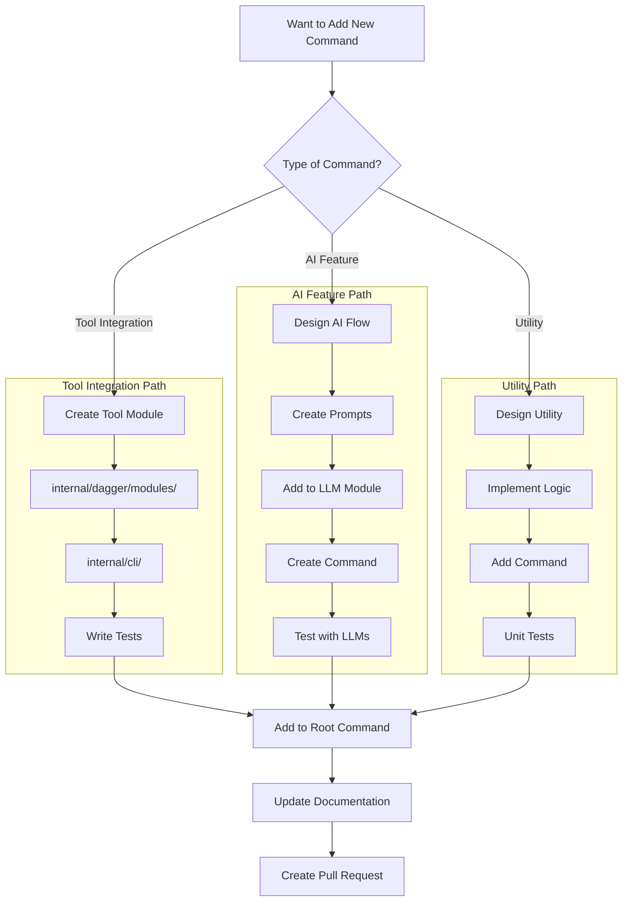

## Creating a New Dagger Module

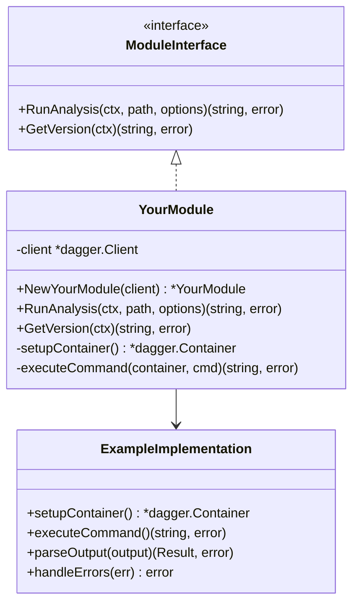

### Module Implementation Example

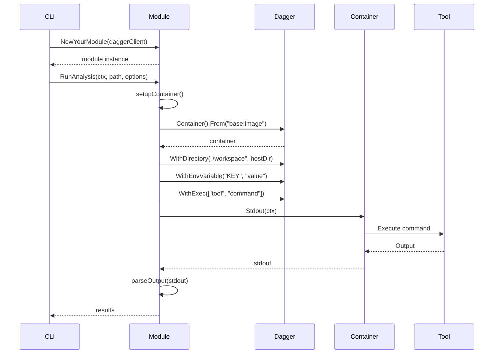

## Adding CloudShip Integration

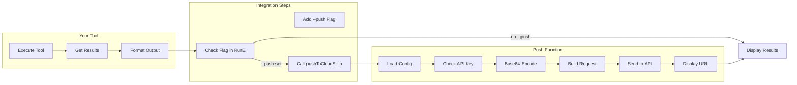

## Adding AI Table Support

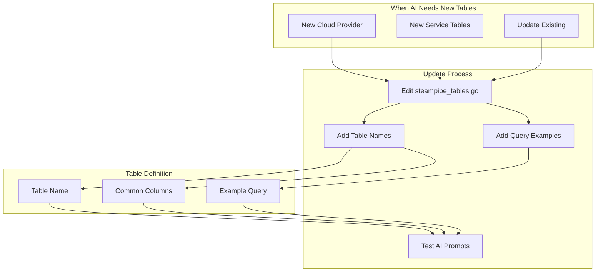

## Testing Strategy

```mermaid
graph TB
    subgraph "Test Types"
        UNIT[Unit Tests]
        INTEGRATION[Integration Tests]
        E2E[End-to-End Tests]
        AI_TEST[AI Tests]
    end
    
    subgraph "Unit Test Targets"
        PARSE[Parsing Logic]
        FORMAT[Formatting]
        VALIDATION[Validation]
    end
    
    subgraph "Integration Test Targets"
        DAGGER_INT[Dagger Integration]
        API_INT[API Integration]
        TOOL_INT[Tool Integration]
    end
    
    subgraph "E2E Test Scenarios"
        FULL_FLOW[Complete Workflows]
        ERROR_FLOW[Error Scenarios]
        PUSH_FLOW[CloudShip Push]
    end
    
    subgraph "AI Test Scenarios"
        PROMPT_TEST[Prompt Generation]
        TABLE_TEST[Table Recognition]
        FALLBACK_TEST[Fallback Behavior]
    end
    
    UNIT --> PARSE
    UNIT --> FORMAT
    UNIT --> VALIDATION
    
    INTEGRATION --> DAGGER_INT
    INTEGRATION --> API_INT
    INTEGRATION --> TOOL_INT
    
    E2E --> FULL_FLOW
    E2E --> ERROR_FLOW
    E2E --> PUSH_FLOW
    
    AI_TEST --> PROMPT_TEST
    AI_TEST --> TABLE_TEST
    AI_TEST --> FALLBACK_TEST
```

## Configuration Management

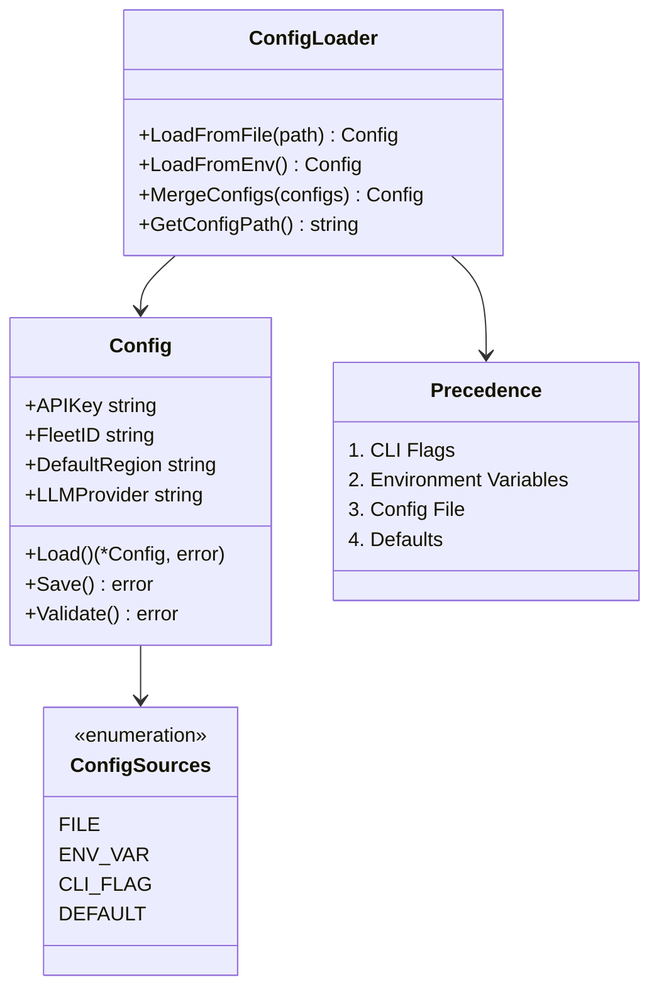

## Error Handling Patterns

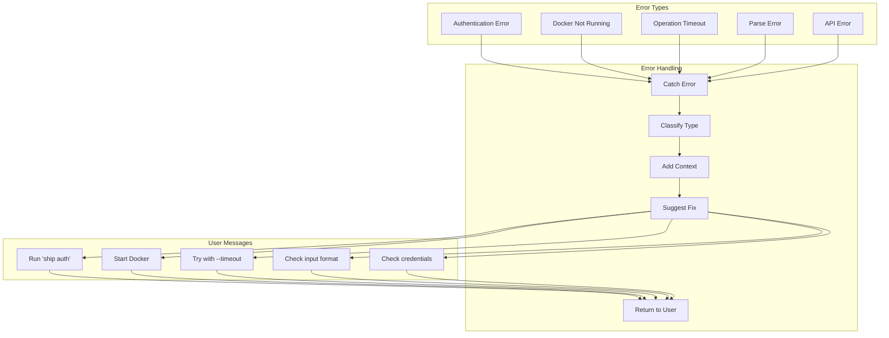

## Contributing Workflow

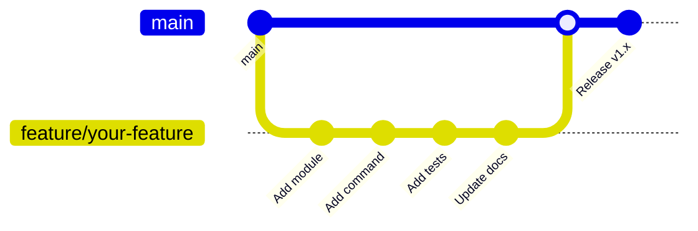

## Module Communication

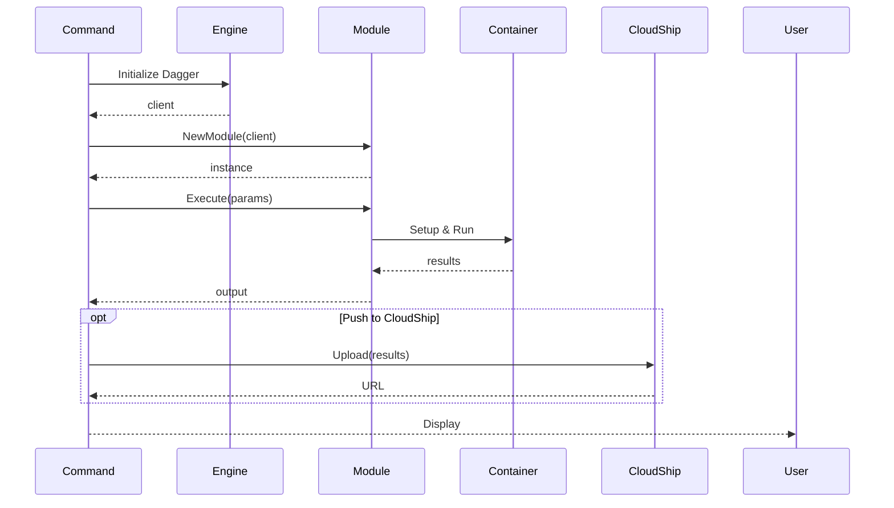

## Debugging Ship CLI

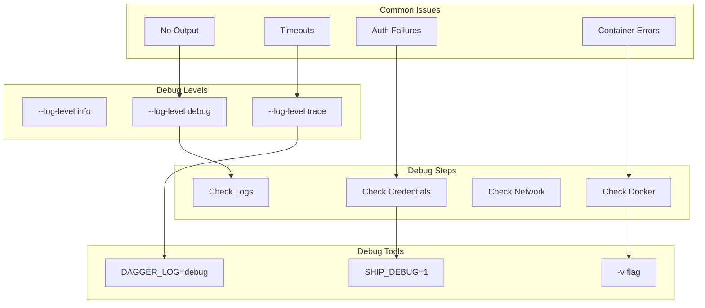

## Performance Optimization

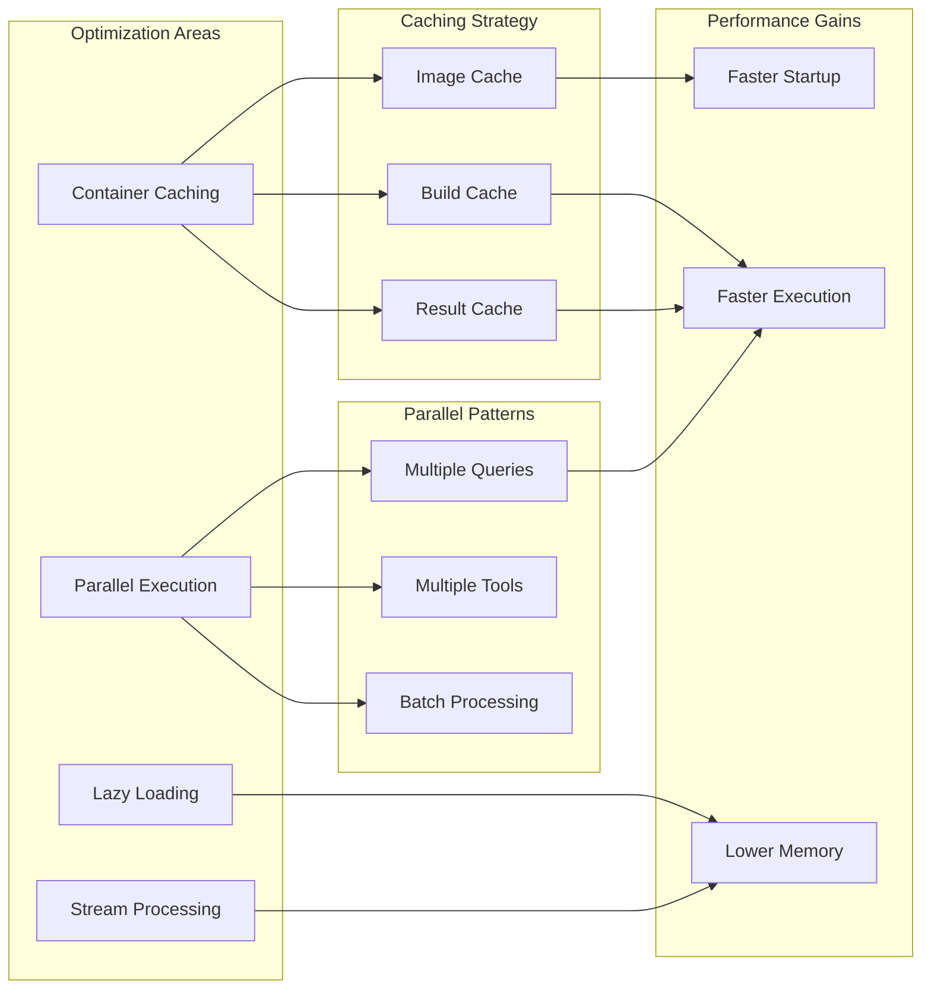

---

This developer guide provides:
- Step-by-step visual guides for adding new features
- Code structure and patterns to follow
- Testing strategies
- Configuration management approaches
- Error handling patterns
- Contributing workflow
- Debugging techniques
- Performance optimization strategies

These diagrams serve as a visual reference for developers looking to understand and extend Ship CLI.